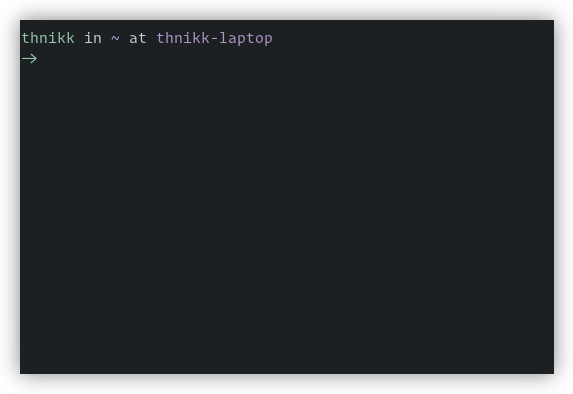

# thnikk zsh theme

A minimal version of the spaceship theme. It features:

- Username and hostname
- Ligature used instead of tiny arrow (This requires a font like FiraCode.)
- Fun colors
- Prompt on second line so you always start typing at the same place
- Truncated directories past a depth of two (ie ../polybar/scripts)
- Hostname changes color if using SSH
